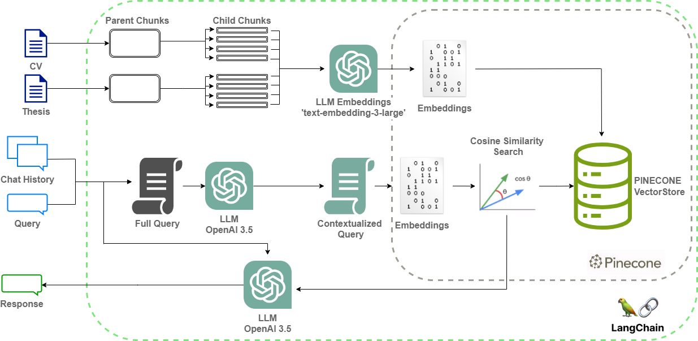

# Test RAG Chatbot

This project aims to implement the state-of-the-art techniques in Retrieval-Augmented Generation (RAG). Our primary objective is to collaboratively engage in a hands-on, end-to-end project that leverages the latest advancements in the LangChain library .Additionally, we focus on the interaction with the vector database Pinecone  
 ensuring a cutting-edge approach to data management and retrieval.

 ,

## Table of Contents

1. [Introduction](#introduction)
2. [Readiness](#readiness)
    - [OpenAI](#OpenAI)
    - [Pinecone](#Pinecone)
    - [Langchain](#Langchain)
3. [Vector database population](#vector-database-population)
4. [Retrieval-Augmented Generation (RAG)](#Retrieval-Augmented-Generation-(RAG))
5. [Web application](#Web-application)
6. [Deployment](#Deployment)

## Introduction

Welcome to the ChatBotRAG project, where we embark on a journey to showcase the cutting-edge advancements in conversational AI technology. Our primary goal is to demonstrate the state-of-the-art capabilities of Retrieval-Augmented Generation (RAG), a powerful approach that combines retrieval-based methods with generative models to create more contextually relevant responses.

At the heart of our project lies the integration of advanced tools and technologies. We leverage the Vector Database Pinecone, a high-performance, scalable solution for storing and querying high-dimensional vector data. By harnessing the power of Pinecone, we ensure rapid and efficient retrieval of relevant information to enrich the conversational experience.

Additionally, we utilize the LangChain library, a sophisticated toolkit that empowers us to implement the latest advancements in natural language processing. With LangChain, we can seamlessly integrate state-of-the-art language models and techniques into our chatbot, enabling it to understand and generate human-like responses with unparalleled accuracy and fluency.

To bring our project to life, we employ a Flask Python server, providing a robust and flexible platform for hosting our chatbot. The Flask server acts as the backbone of our system, facilitating communication between the user interface and the backend components, ensuring smooth and seamless interactions.

Furthermore, we have enriched our database by loading the author's Curriculum Vitae (CV) and postgraduate thesis. By incorporating this valuable information into the database, we enhance the chatbot's ability to provide insightful and relevant responses, tailored to the user's queries and interests.

The model block diagram is represented as:

 ,

## Readiness
Before diving into the project coding, it's essential to set up accounts with Pinecone, OpenAI, and LangChain. These accounts will serve as the foundation for accessing the necessary tools and APIs required for the project's development. By creating accounts with these platforms, you gain access to powerful technologies that will enable you to leverage cutting-edge capabilities in vector database management, natural language processing, and AI-powered generation.

### OpenAI
OpenAI offers a suite of powerful APIs and models for natural language processing and generation. With an OpenAI account, you gain access to state-of-the-art language models, including GPT (Generative Pre-trained Transformer) models, which can be used to power your chatbot's conversational capabilities.

To know how to get your OpenAI API key: https://www.youtube.com/watch?v=6LAl5IJM080

### Pinecone
Pinecone provides a scalable vector database solution, allowing you to store and query high-dimensional vector data efficiently. By creating a Pinecone account, you can set up your vector database, configure indexing parameters, and integrate it seamlessly into your project workflow.

To get started with Pinecone follow this video: https://www.youtube.com/watch?v=AGKY_Q3GjRc

### Langchain
LangChain provides a comprehensive library of tools and resources for implementing advanced language processing techniques. By creating a LangChain account, you can access pre-trained models, libraries, and utilities that will streamline the development process and enhance the performance of your chatbot.

It is recommended to register and implement LangSmith.

## Vector database population

To populate the Pinecone DB you have to execute this notebook: [inicial.ipynb](inicial.ipynb)

## Retrieval-Augmented Generation (RAG)

The code in [application.py](application.py) file implements RAG in latest version of LangChain.

Here's a breakdown of what each part of the code is doing:

Setting API Keys: The variables OPENAI_API_KEY, LANGCHAIN_API_KEY, and PINECONE_API_KEY store the API keys needed to authenticate with the respective services.

Initializing ChatOpenAI: This creates an instance of the ChatOpenAI class, which likely interacts with OpenAI's GPT-3.5 model to generate responses to user input.

Embedding Technique with OpenAI: An instance of the OpenAIEmbeddings class is created to handle text embeddings using OpenAI's model. The embed_query method is then called to embed the text "hola" and print its length.

Connecting to Pinecone Database: This part connects to the Pinecone vector database using the PineconeVectorStore class. It sets up an index with a given name and namespace and creates a retriever for querying the database based on embeddings.

Creating Chat Prompt Template: A chat prompt template is created using the ChatPromptTemplate class. It defines the prompt structure for the chatbot, including placeholders for system prompts, chat history, and user input.

Creating Conversation Chains: Two conversation chains are created using the create_stuff_documents_chain and create_retrieval_chain functions. These chains likely define the conversation flow and how the chatbot interacts with the Pinecone database to retrieve relevant information.

Defining Session History Storage: A dictionary named store is defined to store session history for the chatbot. The get_session_history function retrieves the session history for a given session ID.

Invoking Conversation Chain: The conversational_rag_chain is invoked with user input and session configuration. It generates a response from the chatbot based on the conversation chain's logic and stores the session history in the store dictionary.

Defining Completion Function: The get_completion function is defined to handle user input and retrieve the chatbot's response. It invokes the conversation chain and returns the last message from the session history.

## Web application

The Flask app is instatiated in the mentioned [application.py](application.py)  file and calling the [index.html](templates/index.html).

This index.html code represents a basic web page for a chatbot application. Here's a general overview of what each part of the code does:

Document Type Declaration (<!DOCTYPE html>): Specifies the HTML5 document type.

HTML Structure:

//<html>: The root element of the HTML document.
"<head>:" Contains meta-information about the HTML document, such as the title, viewport settings, links to external resources (stylesheets, icons), and scripts.
"<body>:" Contains the content of the HTML document, including header, main content, and footer sections.
Head Section:

"<title>:" Sets the title of the web page.
"<meta name="viewport">:" Defines the viewport properties for responsive web design.
":" Imports the jQuery library for JavaScript functionality.
Styling:

The "<style>" block contains CSS rules that define the appearance and layout of elements on the page. It includes styles for the header, container, footer, chat interface, input field, and media queries for responsive design.
Body Section:

"
": Defines the header section of the page, including the title and logo.

: Contains the main content of the page, including the chat interface and additional information.

 and 
: Divides the content into two columns, with the chat interface on the right and additional information on the left.

: Defines the footer section of the page, including copyright information and credits.
JavaScript:

Inline JavaScript functions handle user interaction with the chatbot. getBotResponse() function sends user input to the server and displays bot responses in the chat interface. Key press event listener triggers the getBotResponse() function when the Enter key is pressed in the text input field.
Overall, this index.html code creates a basic web page with a chatbot interface, allowing users to interact with the chatbot and receive responses. The page layout is responsive, adjusting its appearance based on the device screen size.
